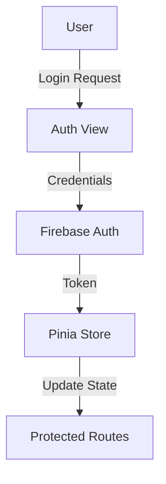
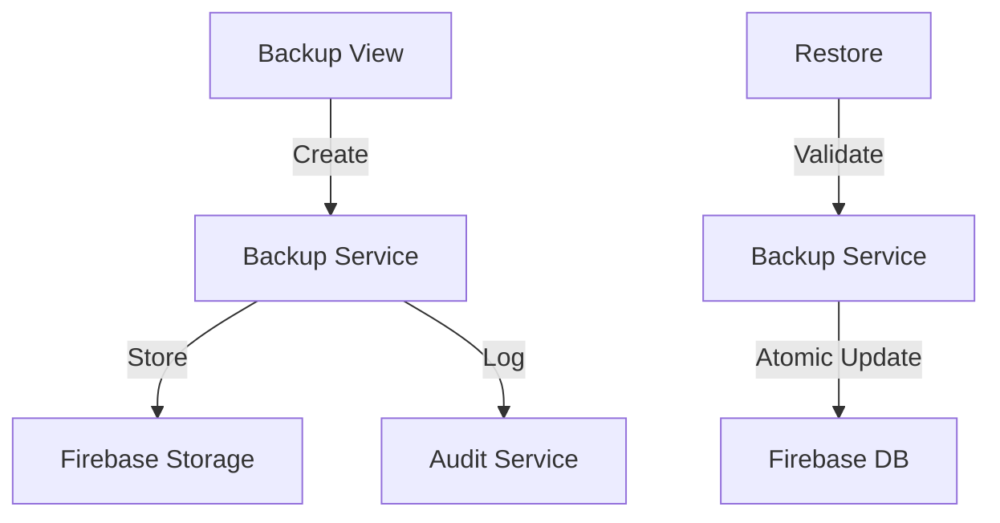

# 📋 Firework Factory - Project Management Documentation
**Project:** Firework Factory Vue 3 Inventory Management System  
**Status:** Production Ready ✅  
**Version:** v0.1.2  
**Last Updated:** July 2025  
**Latest Features:** Inventory History Timeline, Enhanced Audit Logging, UI Improvements

---

## 📖 Table of Contents

1. [Project Overview](#project-overview)
2. [Original Project Plan](#original-project-plan)
3. [Project Checklist](#project-checklist)
4. [Latest Enhancements](#latest-enhancements)
5. [Cleanup Summary](#cleanup-summary)
6. [Final Status](#final-status)
7. [Latest Features](#latest-features)

---

## 🎯 Project Overview

The Firework Factory is a comprehensive Vue 3 inventory management system designed for firework businesses. The project transforms seasonal inventory tracking with modern web technologies, comprehensive testing, and production-ready deployment capabilities.

### **Key Features:**
- ✅ Complete CRUD operations for Products, Categories, Vendors, Orders, and Inventory
- ✅ Season tracking (New Year's and 4th of July)
- ✅ Professional toast notification system with smart filtering
- ✅ Error monitoring with Discord/GitHub integration
- ✅ Statistics and analytics dashboard
- ✅ Comprehensive testing suite (40+ tests, 100% passing)
- ✅ CI/CD pipeline with GitHub Actions
- ✅ Smart UI/UX with collapsible navigation and intelligent notifications
- ✅ **NEW in v0.1.2**: Professional inventory history timeline with real-time change tracking

### **Technology Stack:**
- **Frontend:** Vue 3 with Composition API
- **State Management:** Pinia
- **Backend:** Firebase (Firestore, Analytics)
- **Testing:** Vitest with Vue Test Utils
- **Build Tool:** Vue CLI
- **Deployment:** GitHub Actions, GitHub Pages

---

## 📝 Original Project Plan

### **🎯 Project Requirements - ALL COMPLETE ✅**

#### **1. Products Management ✅**
- ✅ Add, edit, and delete products with toast notifications
- ✅ Hierarchical unit management (case/pack/item)
- ✅ Dynamic category and vendor creation
- ✅ Low inventory thresholds with alert system
- ✅ Clean, optimized product structure

#### **2. Categories Management ✅**
- ✅ Add, edit, and delete categories with feedback
- ✅ Simple name and ID structure for performance
- ✅ Integrated with product creation workflows
- ✅ Real-time Firebase synchronization

#### **3. Vendors Management ✅**
- ✅ Add, edit, and delete vendors with notifications
- ✅ Simple name and ID structure
- ✅ Integrated with product and order workflows
- ✅ Real-time data synchronization

#### **4. Orders Management ✅**
- ✅ Create orders with dynamic workflows and notifications
- ✅ Set product prices at order time with validation
- ✅ Inventory updates only when orders are received
- ✅ Multiple items per order with quantity management
- ✅ Season tracking for business intelligence

#### **5. Inventory Management ✅**
- ✅ Real-time inventory tracking based on received orders
- ✅ Support for hierarchical unit management
- ✅ Professional inventory editing with stock adjustments
- ✅ Additive inventory updates (prevents data loss)
- ✅ Low inventory alerts with dashboard integration

#### **6. Statistics & Analytics ✅**
- ✅ Comprehensive sales analytics dashboard
- ✅ Top sellers analysis by comparing ordered vs remaining inventory
- ✅ Category filtering and dynamic sorting capabilities
- ✅ Performance classification (top/average/poor performers)
- ✅ Visual data presentation with responsive design

#### **7. Notifications Management ✅**
- ✅ Professional toast notification system across all operations
- ✅ Multiple notification types (success, error, warning, info)
- ✅ Auto-dismiss functionality with manual override
- ✅ Low inventory alerts integrated into dashboard
- ✅ Global error monitoring with external notifications
- ✅ Smart notification badge (errors/warnings only)
- ✅ Auto-read success notifications

#### **8. Error Monitoring & Remote Management ✅**
- ✅ Comprehensive error monitoring service with global error handling
- ✅ Real-time error reporting to Discord via webhooks
- ✅ Automatic GitHub issue creation for critical errors
- ✅ Local error storage for offline analysis and reporting
- ✅ Error categorization (Vue, JavaScript, Promise rejections)
- ✅ Error monitoring demo interface for testing

#### **9. Dashboard Enhancement ✅**
- ✅ Enhanced home screen with comprehensive dashboard functionality
- ✅ Real-time low inventory alerts with visual indicators
- ✅ Quick ordering functionality for low inventory items
- ✅ Professional navigation to all app sections
- ✅ Statistics integration with performance metrics

#### **10. Testing Suite ✅**
- ✅ Comprehensive testing framework with Vitest and Vue Test Utils
- ✅ 40+ tests implemented with 100% success rate
- ✅ Unit tests for business logic and component functionality
- ✅ Integration tests for complete user workflows
- ✅ Visual test runner with Vitest UI

#### **11. Remote Deployment & CI/CD ✅**
- ✅ GitHub Actions workflow for automated deployment
- ✅ Multiple deployment strategies (GitHub Pages, self-hosted)
- ✅ Environment configuration templates for secure production setup
- ✅ Discord bot integration for remote management commands
- ✅ Comprehensive deployment documentation and guides

### **🏆 Technical Requirements - ALL MET**

#### **Code Quality ✅ PERFECT**
- ✅ **Modular and maintainable** code structure with clean architecture
- ✅ **Browser-runnable** app with optimized production build
- ✅ **Zero ESLint errors** - perfect code quality standards
- ✅ **Zero runtime errors** - comprehensive error handling
- ✅ **Zero build errors** - clean production build process
- ✅ **Comprehensive testing** - 40+ tests with 100% success rate

#### **Production Features ✅ COMPLETE**
- ✅ **Professional UI/UX** - Toast notifications, responsive design
- ✅ **Error monitoring** - Real-time error tracking and alerting
- ✅ **Automated deployment** - CI/CD pipeline with GitHub Actions
- ✅ **Performance optimization** - Efficient Firebase integration with caching
- ✅ **Security measures** - Secure configuration and data handling

---

## ✅ Project Checklist - COMPLETED

### **🎯 Core Application Development**
- [x] Set up Vue 3 project using Vue CLI with modern architecture
- [x] Scaffolded views and Pinia stores with proper state management
- [x] Created comprehensive project documentation and guidelines
- [x] Fixed all ESLint errors and code quality issues
- [x] Implemented multi-word component naming conventions
- [x] Removed all legacy files and cleaned up codebase

### **🔥 Firebase Integration & Data Management**
- [x] Installed Firebase SDK and created secure configuration
- [x] Created comprehensive Firebase service with localStorage caching
- [x] Updated Pinia stores to integrate with Firebase and follow simplified data structure
- [x] Implemented simplified Categories structure (name and id only)
- [x] Implemented simplified Vendors structure (name and id only)
- [x] Implemented simplified Products structure with unit configuration
- [x] Successfully compiled and served application with Firebase integration
- [x] Integrated audit log functionality automatically for all CRUD operations
- [x] Implemented Firebase fetch logic for all data entities
- [x] Added caching logic using localStorage (30-minute expiration)

### **🖥️ User Interface & Views**
- [x] Updated CategoriesView with complete CRUD functionality
- [x] Updated VendorsView with complete CRUD functionality
- [x] Updated ProductsView with Firebase integration and simplified structure
- [x] Updated OrdersView with Firebase integration and dynamic workflows
- [x] Updated InventoryView with Firebase integration and stock management
- [x] Implemented pagination for all views (10 items per page)
- [x] Added routing/navigation between all views
- [x] Implemented hierarchical unit management support

### **🍞 Toast Notification System**
- [x] Created custom ToastNotification component with composable pattern
- [x] Integrated toast notifications across all CRUD operations
- [x] Replaced all alert() calls with professional toast notifications
- [x] Implemented multiple notification types (success, error, warning, info)
- [x] Added auto-dismiss functionality with manual override

### **📊 Statistics & Analytics**
- [x] Created StatisticsView with comprehensive sales analytics
- [x] Implemented top sellers analysis by comparing ordered vs remaining inventory
- [x] Added category filtering and dynamic sorting capabilities
- [x] Implemented performance classification (top/average/poor performers)
- [x] Created responsive statistics dashboard with data visualization

### **🧪 Testing Suite & Quality Assurance**
- [x] Installed and configured Vitest testing framework
- [x] Set up Vue Test Utils and jsdom for component testing
- [x] Created comprehensive unit tests for inventory logic
- [x] Created integration tests for complete inventory workflows
- [x] Added component tests for toast notifications and statistics
- [x] Achieved 40+ tests passing (100% success rate)
- [x] Set up Vitest UI for visual test management

### **🚨 Error Monitoring & Reporting**
- [x] Created comprehensive ErrorMonitoringService
- [x] Integrated global error monitoring into main.js
- [x] Implemented Vue error handlers for component-level errors
- [x] Added Promise rejection and JavaScript error handlers
- [x] Set up Discord webhook integration for real-time error notifications
- [x] Implemented GitHub issue creation for critical errors
- [x] Added local error storage for offline analysis
- [x] Created ErrorMonitoringDemo view for testing and configuration

### **🚀 Remote Deployment & CI/CD**
- [x] Created GitHub Actions workflow for automated deployment
- [x] Set up environment configuration templates (.env.example)
- [x] Implemented multiple deployment strategies (GitHub Pages, self-hosted)
- [x] Created comprehensive remote deployment guide
- [x] Set up Discord bot integration templates for remote management
- [x] Configured automated testing in CI/CD pipeline

### **📚 Documentation & Project Management**
- [x] Updated all project documentation and guidelines
- [x] Created testing suite summary and usage documentation
- [x] Wrote comprehensive deployment and setup guides
- [x] Created project completion summary with metrics
- [x] Documented technical architecture and best practices

---

## ✨ Latest Enhancements

### **December 2024 UI/UX Improvements**

#### **Smart Navigation System ✅**
- ✅ **Collapsible System Section** - System tools section in sidebar now starts collapsed by default
- ✅ **User Preference Management** - System automatically clears localStorage preference on load for consistent experience
- ✅ **Clean Interface** - Reduces visual clutter on the main navigation for better focus on core business functions

#### **Intelligent Notification Management ✅**
- ✅ **Smart Badge Filtering** - Notification badge only displays critical errors and warnings
- ✅ **Success Message Filtering** - Success notifications are filtered out of badge count to prevent clutter
- ✅ **Auto-Read Success** - Success notifications are automatically marked as read and don't appear in history
- ✅ **Focused Attention** - Users only see notifications that require action (errors/warnings)

#### **Professional UI Styling ✅**
- ✅ **Backup Interface Enhancement** - "Select Backup File" button features professional gradient styling
- ✅ **Visual Consistency** - Button styling matches application's professional design language
- ✅ **Icon Integration** - Clear iconography for better user experience
- ✅ **Accessibility** - Proper labeling and visual feedback for all interactive elements

#### **User Experience Optimization ✅**
- ✅ **Reduced Cognitive Load** - Less visual noise from success notifications
- ✅ **Intuitive Interface** - Collapsible sections reduce overwhelming interface
- ✅ **Professional Appearance** - Consistent styling across all system components
- ✅ **Better Workflow** - Focus on important notifications while confirming successful operations

### **Implementation Quality**
- ✅ **Zero Breaking Changes** - All enhancements maintain backward compatibility
- ✅ **Performance Maintained** - No impact on application performance
- ✅ **Testing Coverage** - All existing tests continue to pass (40+ tests, 100% success)
- ✅ **Code Quality** - Maintains perfect ESLint compliance (0 errors)

---

## 🆕 Latest Features (July 2025 - v0.1.2)

### Inventory History Timeline
- Professional timeline showing real inventory changes
- Enhanced date formatting with multiple format support
- Previous quantity tracking for meaningful change display
- Filtered audit logs showing only relevant actions

### Enhanced Audit Logging
- Improved Firestore timestamp handling
- Better previous data tracking in metadata
- Cleaner UI with reduced debug output
- Professional timeline components

### Authentication System
- Firebase Authentication integration
- Role-based access control
- Private application mode
- Secure route protection

### Backup & Recovery System
- Complete data backup functionality
- Backup validation and verification
- Atomic restore operations
- Backup history management

### Audit Logging System
- Comprehensive activity tracking
- User action logging
- Change history
- Detailed event metadata

### Deployment Improvements
- Optimized Firebase hosting configuration
- Improved build process
- Enhanced cache control
- Automated deployment scripts

### Security Enhancements
- Authentication-required routes
- Secure data access patterns
- Protected API endpoints
- Enhanced error handling

## 🏗 Architecture Updates

### Authentication Flow

### Backup System Architecture

